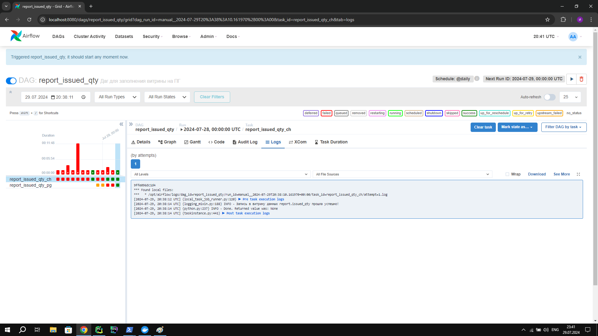
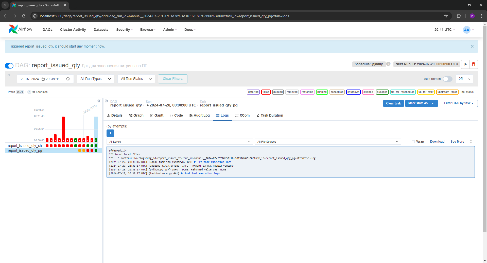
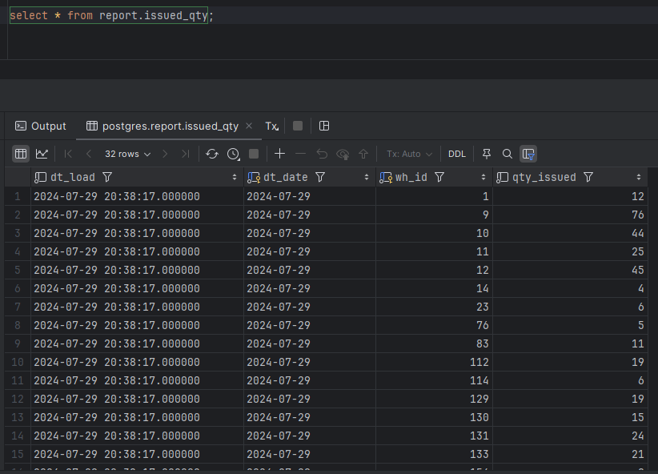

# Изучение Airflow

## Домашнее задание по Airflow:
1. Установить локально Airflow, ClickHouse, Postgres. Не забыть про то, что им нужно общаться, решайте сами, кому как удобно - через ip хоста или через добавления ClickHouse и Postgres в сеть Airflow.
2. Сделать даг, берущий данные из вашего локального ClickHouse, как-то их трансформирующий (не обязательно, но желательно), а затем кладущий в витрину на том же клике (сделать схему reports). После этого даг должен взять данные из только что созданной витрины, преобразовать в датафрейм пандас, и заинсертить их в Postgres по методологии, рассказанной Львом на лекции по Postgres (процедура импорта).

В репозиторий гит выложить:
1. Даг.
2. Скрин, что даг успешно отработал
3. Скрин с данными из витрины Postgres

___

## Результат выполнения задания
1. Для установки Airflow, ClickHouse, Postgres воспользуемся написанными docker-compose.yml файлами:
   - [Postgres](postgres/docker-compose.yml)
   - [Clickhouse](clickhouse/docker-compose.yml)
   - [Airflow](airflow/docker-compose.yml)
    
    Для того чтобы контейнеры были в одной сети воспользуемся следующими командами:
    ```
    docker network connect airflow-default postgres
    docker network connect airflow-default clickhouse
    ```
    Настроим Postgres для успешного функционирования дага. Для этого воспользуемся файлом [script_pg.sql](postgres/script_pg.sql)
    
    С помощью этих запросов мы создадим нужные нам схемы, пользователя, таблицу, процедуру импорта данных и функцию получения данных.

    Также настроим ClickHouse, чтобы даг обновлял данные и на клике. Для этого воспользуемся файлом [script_ch.sql](clickhouse/script_ch.sql)
    
    С помощью этих запросов мы создаем пользователя, нужную нам базу данных и таблицу в ней.
___

2. Написанный [даг](airflow/dags/report_issued_qty.py) находится в папке [dags](airflow/dags/)
   
    Скрин, что даг успешно отработал:

    
    
   
    Скрин с данными из витрины Postgres: 

    

   Скрин с данными из вызова функции Postgres:

    

   Результат вызова функции:
   ```
   {
     "data": [
       {
         "wh_id": 10,
         "dt_date": "2024-07-29",
         "qty_issued": 44
       },
       {
         "wh_id": 11,
         "dt_date": "2024-07-29",
         "qty_issued": 25
       },
       {
         "wh_id": 12,
         "dt_date": "2024-07-29",
         "qty_issued": 45
       }
     ]
   }  
   ```
